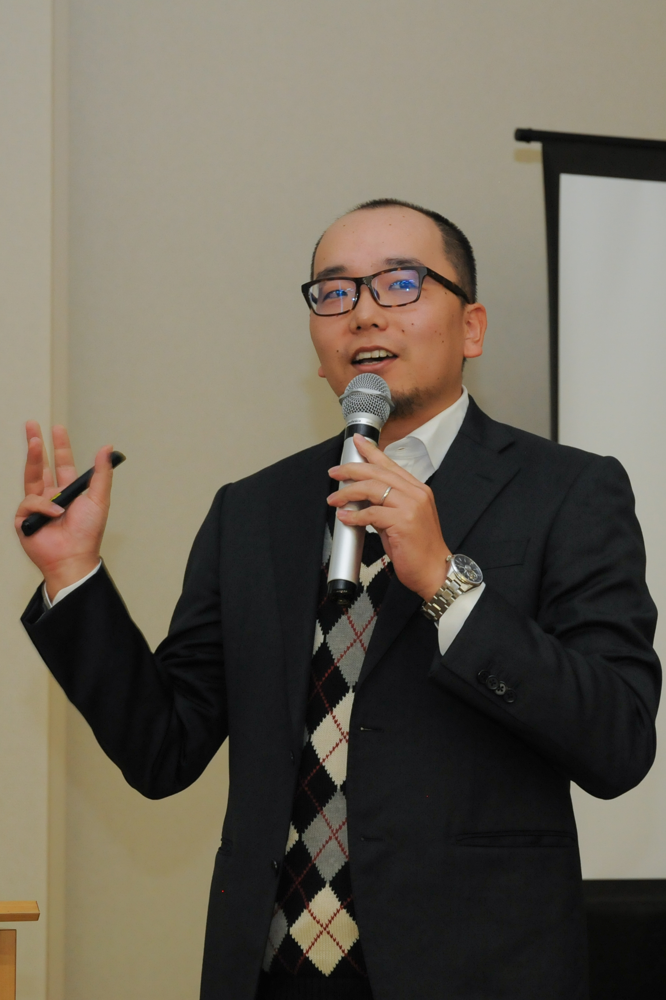

## PERSONAL INFORMATION
####  Yoshihiko Kunisato
####  Associate Professor of Clinical Psychology
####  Department of Psychology,School of Human Sciences, SENSHU UNIVERSITY
####  DATE OF BIRTH: November 11, 1983
####  PLACE OF BIRTH: Hyougo Japan
####  CITIZENSHIP: Japanese
####  ADRESS: 2-1-1, Higashi-Mita, Tama, Kawasaki, 214-8580, JAPAN
####  E-MAIL: ykunisato (at sign) psy.senshu-u.ac.jp
####  [Google Scholar](http://scholar.google.com/citations?hl=en&user=cIhFY1YAAAAJ&view_op=list_works&gmla=AJsN-F7XXdjEVvO0pY8lFA19xtBq863U6a1bfQ12xa94TeIywgyckyZZLTHy4w22BKWLQJNyO9poNHdBCbXOlOjBAtMt007KIQvJ3pw1eoK3M-H7cbPbOmyU5ERgq4Wflfy8ZAjESXzV)
####  [Researchgate](https://www.researchgate.net/profile/Yoshihiko_Kunisato)

## EDUCATION
####  2002 - 2006 Faculty of Education, Gunma University
####  2006 - 2008 Master Course, Graduate School of Education, Hiroshima University
####  2008 - 2011 Doctor Course, Graduate School of Biomedical Science, Hiroshima University
 
## PROFESSIONAL CERTIFICATION
####  2006 Bachelor of Education, Gunma University
####  2008 Master of Science in Clinical Psychology, Hiroshima University
####  2011 Doctor of Philosophy in Medical Science, Hiroshima University

## ACADEMIC APPOINTMENTS AND EMPLOYMENT
####  2009 – 2011 JSPS Research Fellowship for Young Scientists, Doctoral Course Students (DC1)
####  2011 - 2013 Research Associate,Faculty of Human Sciences, Waseda University
####  2013 -2015 Lecturer (with tenure),Faculty of Human Sciences, Senshu University
####  2015- Associate Professor, Faculty of Human Sciences, Senshu University
 
## PROFESSIONAL SOCIETIES
####  The Japanese Psychological Association (JPA) Member, 2006-present
####  Japanese Association of Behavior Therapy (JABT) Member, 2006-present

